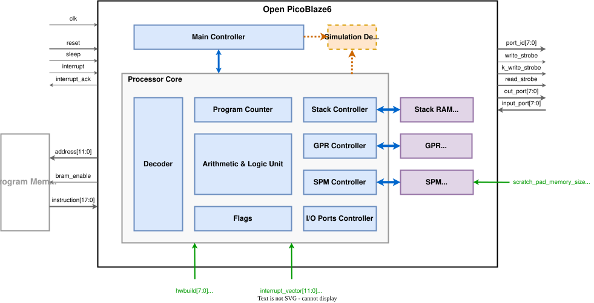

# Open PicoBlaze6

## Introduction

Open PicoBlaze6 is a synthesizable and behavioral Verilog implementation compatible with Xilinx PicoBlaze KCPSM6. The project provides a Verilog module named `opb6`, reference KCPSM6 design, FPGA synthesis projects, test programs, and simulation environments for comparison and validation.

Its architecture is shown in the figure below.
<center></center>


## Directory

```
open_picoblaze6
├── doc/                KCPSM6 user guide and related documentation
├── rtl/                RTL source code
    ├── opb6/           Open PicoBlaze6 Verilog implementation
    ├── kcpsm6/         KCPSM6 reference Verilog source
├── fpga/               Vivado projects for opb6 and kcpsm6 systems
├── test/               PicoBlaze assembler and test assembly programs
├── tb/                 Testbenches for opb6 and kcpsm6 systems
├── sim/                ModelSim simulation work areas
```


## Design

The design uses Verilog-2001 syntax, and ensures logical equivalence with KCPSM6 through formal verification.

`opb6` is the top-level Open PicoBlaze6 module, and it is split into several submodules, including:

* `opb6_main_ctrl`: main state, reset, sleep, and interrupt controller
* `opb6_core`: instruction execution datapath and control
* `opb6_alu`: arithmetic and logic unit (submodule of `opb6_core`)
* `opb6_gpr`: general purpose register file
* `opb6_sp_ram`: parametric single port RAM module for scratch pad memory and stack RAM
* `opb6_sim_dbg`: simulation debug helper

The design includes several macro definitions, with the following functions:

* `HAS_ASYNC_RST`: If defined, including an active low asynchronous reset input signal `rst_n` to reset the core registers (for ASIC designs requiring global asynchronous reset).
* `SIM`: If defined, including parameter checking (for simulation only).
* `HAS_SIM_DBG`: If defined, including simulation debug module `opb6_sim_dbg` (for simulation only).


## FPGA Synthesis

The `fpga` directory contains two Vivado based synthesis projects, with device `xc7k325tffg900-2`:

* `opb6_sys`: Open PicoBlaze6 test system
* `kcpsm6_sys`: KCPSM6 test system

The table below shows a comparison of FPGA synthesis results (clock constraint **160 MHz**):

| Processor Core | SPM Size (Byte) | Slice | Max Freq. (MHz) |
| :---: | :----: | :---: | :---: |
| **`opb6`** | 64 | 41 | 211.37 |
| `kcpsm6` | 64 | 33 | 202.43 |
| **`opb6`** | 128 | 44 | 205.63 |
| `kcpsm6` | 128 | 34 | 199.88 |
| **`opb6`** | 256 | 47 | 198.65 |
| `kcpsm6` | 256 | 42 | 191.86 |


## Verification

Verification is organized around prepared test programs, simulation testbenches, and comparison runs.

* The `test` directory includes PicoBlaze assembly codes and generated HEX files using `kcpsm6.exe`. These programs are used to exercise instruction execution, memory access, interrupts, and compatibility behavior.
* The `tb` directory contains SystemVerilog testbenches. The testbench `tb_opb6_vs_kcpsm6` is used to compare Open PicoBlaze6 behavior against KCPSM6.
* The `sim` directory contains Xilinx simulation library files, and simulation work areas with scripts for ModelSim.
